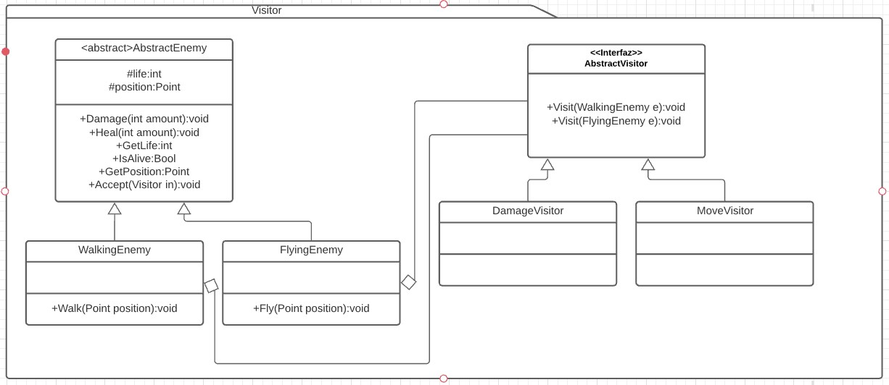

# Visitor
Es un patrón de comportamiento. [Link descripción](https://sourcemaking.com/design_patterns/visitor)

El patrón describe una manera de implementarle funcionalidad a un objeto desde un objeto externo llamado visitor. El objeto a modificar es enviado como parametro al visitor y el visitor realiza alguna acción accediendo a los métodos publicos del objeto visitado

## Diagrama de clases

## SOLID

* Single responsability

Cada visitor tiene la responsabilidad de reaccionar ante cada implementación visitada, es dificil cumplir con este principio en el patrón.

* Open/Closed principle

Si necesitamos agregar un objeto capaz de ser visitado debemos rediseñar el padre de los visitor y cada visitor capaz de visitar al nuevo objeto.

* Liskov substitution

Los objetos visitor deberían poder ser intercambiados en runtime sin problema.

* Interface segregation

Cada Visitor debe tener la habilidad de interactuar con cualquier objeto "visitable" por lo que sería imposible mantener interfaces pequeñas y segregadas para este patrón.

* Dependency inversion

El padre de los objetos visitor debe conocer las implementaciones concretas de todos los objetos "visitables" por lo que es dificil cumplir con este principio.